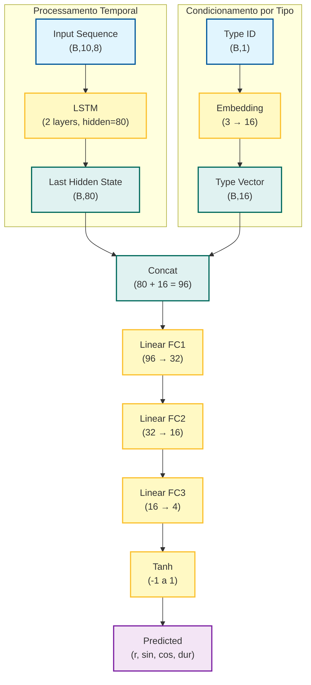

# LSTM for reconstructing spatial trajectories

LSTM model for reconstructing spatial trajectories in polar coordinates (circular, spiral, Lissajous). Scripts are available for data creation and visualization, LSTM model training, export of TorchScript wrappers compatible with the [conTorchionist](https://github.com/ecrisufmg/contorchionist) library, autoregressive testing, and visual validation of the generated trajectories.

